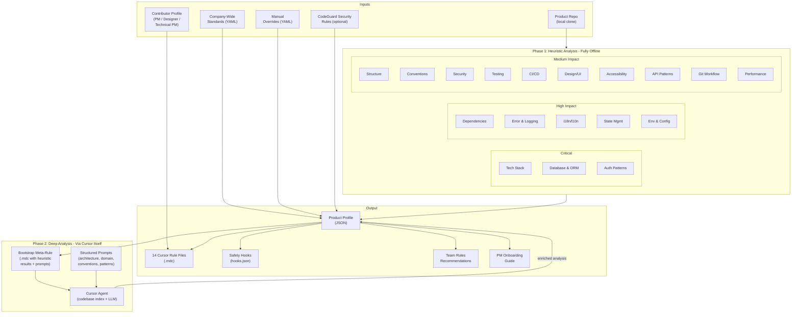
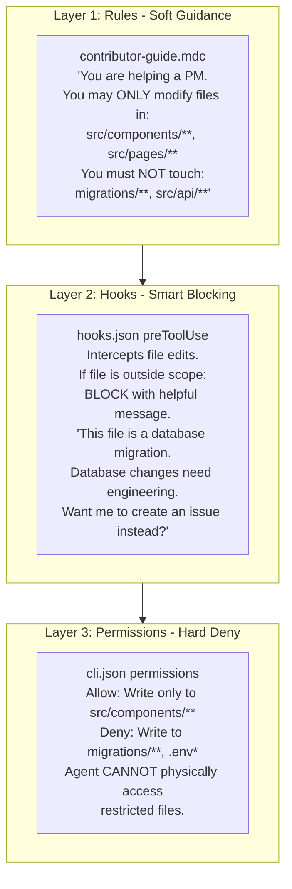
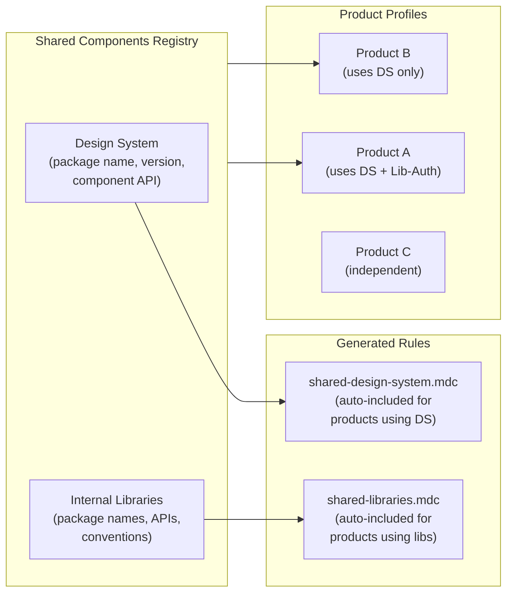
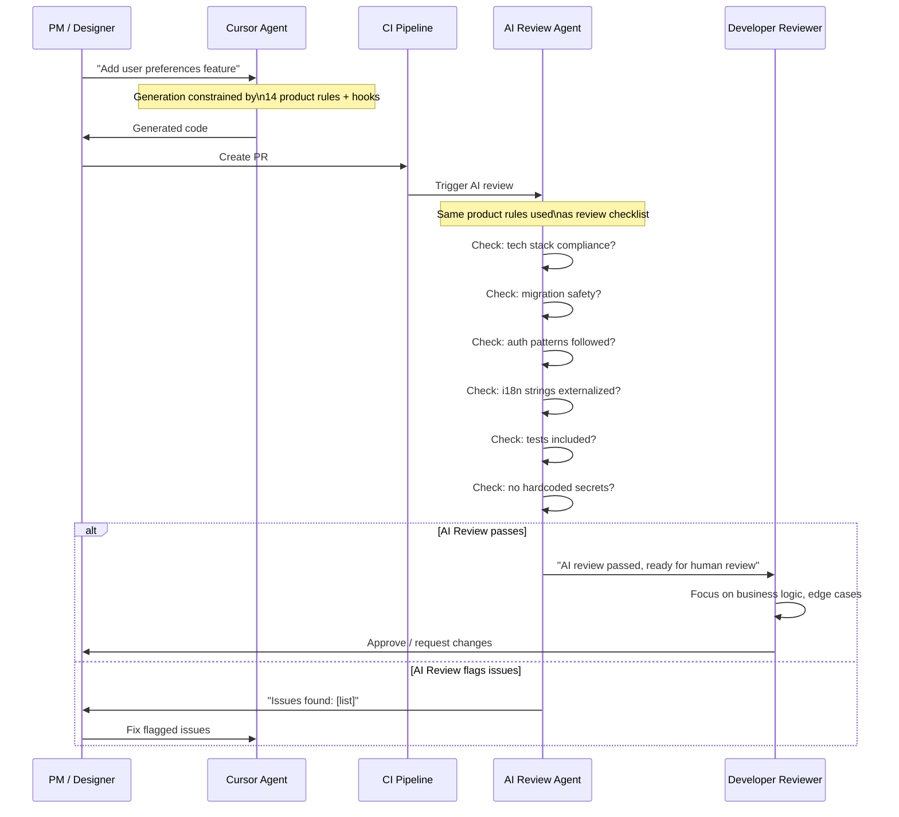

---

name: Product Builders Agent Generator
overview: Build a CLI tool and web application that automatically analyze product codebases and generate tailored Cursor rules, governance (hooks, permissions), and onboarding guides — enabling PMs, designers, and engineers to contribute via AI agents that respect each product's architecture, conventions, security, and quality standards. Two deliverables: Python CLI (analysis, generation, setup) + FastAPI webapp (documentation, onboarding, CLI distribution).
todos:

- id: finalize-architecture
content: "Pre-implementation: Finalize solution architecture with expert validation"
status: completed
- id: project-proposal
content: "Create project proposal document (major decisions, flows, rationale)"
status: completed
- id: scaffold
content: "Phase 1: Create project scaffold (pyproject.toml, requirements.txt, package structure, README)"
status: pending
- id: models
content: "Phase 1: Define ProductProfile dataclass and all analysis result models (18 dimensions)"
status: pending
- id: base-classes
content: "Phase 1: Implement BaseAnalyzer and BaseGenerator ABCs"
status: pending
- id: cli
content: "Phase 1: Build CLI skeleton with click (analyze, generate, setup, export, list, bulk-analyze)"
status: pending
- id: company-standards
content: "Phase 1: Create company standards YAML schema with example files"
status: pending
- id: tech-stack-analyzer
content: "Phase 2: Implement tech stack analyzer"
status: pending
- id: structure-analyzer
content: "Phase 2: Implement project structure analyzer"
status: pending
- id: deps-analyzer
content: "Phase 2: Implement dependency analyzer"
status: pending
- id: conventions-analyzer
content: "Phase 2: Implement conventions analyzer"
status: pending
- id: database-analyzer
content: "Phase 2: Implement data model & database analyzer (CRITICAL)"
status: pending
- id: error-logging-analyzer
content: "Phase 2: Implement error handling & logging analyzer"
status: pending
- id: auth-analyzer
content: "Phase 2: Implement authentication & authorization patterns analyzer (CRITICAL)"
status: pending
- id: git-workflow-analyzer
content: "Phase 2: Implement git workflow & conventions analyzer"
status: pending
- id: templates
content: "Phase 3: Create Jinja2 templates for all Cursor rule types (14 rule files)"
status: pending
- id: cursor-generator
content: "Phase 3: Implement Cursor rules generator"
status: pending
- id: hooks-generator
content: "Phase 3: Implement Cursor hooks generator (Layer 2: smart blocking with helpful messages)"
status: pending
- id: permissions-generator
content: "Phase 3: Implement CLI permissions generator (Layer 3: hard deny via cli.json)"
status: pending
- id: scopes-system
content: "Phase 3: Implement scopes.yaml system (zone definitions + contributor permissions → generates all 3 layers)"
status: pending
- id: bootstrap-rule-gen
content: "Phase 3: Implement multi-step bootstrap meta-rule generator (4-step deep analysis via Cursor)"
status: pending
- id: export-command
content: "Phase 3: Implement export/sync command (with --profile flag for contributor-specific export)"
status: pending
- id: onboarding-generator
content: "Phase 3: Implement PM onboarding guide generator"
status: pending
- id: review-checklist-gen
content: "Phase 3: Implement AI review checklist generator (for CI integration)"
status: pending
- id: security-analyzer
content: "Phase 4: Implement security analyzer (+ optional CodeGuard integration)"
status: pending
- id: testing-analyzer
content: "Phase 4: Implement testing analyzer"
status: pending
- id: cicd-analyzer
content: "Phase 4: Implement CI/CD analyzer"
status: pending
- id: design-analyzer
content: "Phase 4: Implement design/UI analyzer"
status: pending
- id: a11y-analyzer
content: "Phase 4: Implement accessibility analyzer"
status: pending
- id: api-analyzer
content: "Phase 4: Implement API analyzer"
status: pending
- id: i18n-analyzer
content: "Phase 4: Implement i18n/l10n analyzer"
status: pending
- id: state-mgmt-analyzer
content: "Phase 4: Implement state management analyzer"
status: pending
- id: env-config-analyzer
content: "Phase 4: Implement environment & configuration analyzer"
status: pending
- id: perf-analyzer
content: "Phase 4: Implement performance patterns analyzer"
status: pending
- id: webapp-scaffold
content: "Phase 1: Create webapp scaffold (FastAPI + Jinja2, landing page, CLI download page)"
status: pending
- id: webapp-docs
content: "Phase 3: Build documentation pages and per-profile onboarding guides in webapp"
status: pending
- id: webapp-catalog
content: "Phase 3: Build product catalog page (read-only list of analyzed products)"
status: pending
- id: rule-validation
content: "Phase 5: Implement rule validation & quality testing framework"
status: pending
- id: rule-lifecycle
content: "Phase 5: Implement rule lifecycle management (re-analysis triggers, drift detection)"
status: pending
- id: bg-agent-api
content: "Phase 5: Integrate Cursor Background Agent API for automated bulk analysis"
status: pending
- id: metrics
content: "Phase 5: Implement metrics & observability for rule effectiveness"
status: pending
isProject: false

---

# Product Builders — Specialized Agent Generator

---

## Project Proposal (High-Level)

This section captures the major decisions, flows, and rationale — not technical implementation details.

### Business Context

- **Scale**: 50+ products across diverse tech stacks and mixed Git platforms
- **Goal**: Enable PMs, designers, and technical PMs to contribute via Cursor AI agents
- **Constraint**: AI-generated code must be fully compatible with each product's architecture, conventions, security, and quality standards
- **Success metric**: PM-authored PRs pass CI and AI review on first attempt at 80%+ rate

### Solution Overview

Two deliverables:

1. **CLI tool** (Python/Click): Analyzes codebases, generates Cursor rules, governance (hooks, permissions), and onboarding guides. Runs locally, no external LLM APIs.
2. **Web application** (FastAPI + Jinja2): Documentation, per-profile onboarding guides, CLI download page, product catalog (read-only in v1).

### Major Decisions

- **Deep analysis engine**: Cursor itself (bootstrap meta-rule + prompts) — No external LLM API keys; teams already use Cursor
- **Governance**: Project-level files only — No Cursor Enterprise dependency; works for all teams
- **Contributor profiles**: 5 profiles (Engineer, Technical PM, PM, Designer, QA) — Different roles need different access levels
- **Profile assignment**: `setup --profile` generates local hooks + permissions — Rules in git (shared); governance personalized per contributor
- **Enforcement layers**: Rules (soft) → Hooks (block) → Permissions (hard deny) — Defense in depth; helpful UX when blocked
- **Long-term vision**: MCP-native platform (Option D) — Zero-friction onboarding, multi-IDE support; not required for v1

### Main Flows

**One-time setup (Platform Team):** `analyze` → heuristic + bootstrap → Cursor deep analysis → `export` → rules + hooks in product repo

**Contributor onboarding:** `git clone` → `product-builders setup --profile pm` → open Cursor → rules + hooks auto-load

**Day-to-day:** PM asks AI for feature → Cursor constrained by rules + hooks → code generated → PR → review

**Maintenance:** Re-analyze after major releases; feedback loop for rule accuracy

### Long-Term Vision (Option D)

Evolution toward MCP-native platform: MCP Gateway, centralized auth, dynamic rules, multi-IDE (Cursor, Claude Code, Windsurf). Architecture allows this evolution; not required for v1.

---

## Problem

50+ products across diverse tech stacks and mixed Git platforms. PMs/designers need to contribute via Cursor, but the AI agent must produce code fully compatible with each product. We need a system that auto-analyzes a codebase and generates the right Cursor rules to constrain and guide the AI.

---

## Research Findings (Feb 2026)

### Existing Tools Evaluated

- **Rulefy** (npm, 27 stars): Uses repomix + Claude API to generate a single `.rules.mdc` file from a codebase. Proves the LLM approach works, but limited: single monolithic file, no company standards, no multi-product orchestration, requires Anthropic API key.
- **rules-gen** (npm, 15 stars): Interactive CLI picking from a predefined catalog. Not auto-analysis based. Good UX pattern.
- **Repomix** (npm, 21k+ stars): Packs entire codebases into AI-friendly text. Key building block used by Rulefy. Supports MCP protocol.
- **Project CodeGuard / CoSAI** (Python, 389 stars): Security rules framework with unified source format that translates to Cursor, Windsurf, Copilot, and Antigravity formats. Excellent architecture pattern.
- **stack-analyzer** (Python, 4 stars): Detects languages, frameworks, build tools, Dockerization from repos. Validates our heuristic approach.

### Cursor Enterprise Capabilities (2026)

- Rule hierarchy: Team Rules (highest, dashboard-managed) > Project Rules (`.cursor/rules/`) > User Rules
- Enforced Team Rules cannot be disabled by users — ideal for company-wide security/quality standards
- Hooks system: `preToolUse`, `postToolUse`, `beforeShellExecution`, etc. for agent governance
- Background Agent API (Beta): Programmatic agent launches via REST API for automation
- Best practices: focused rules under 500 lines, reference files, micro-examples, priorities 1-100

### Why We Need Our Own Tool

- **Rulefy** generates 1 file, not the multi-file scoped approach Cursor recommends
- **Rulefy** has no concept of company-wide standards or layered rules
- **rules-gen** uses a static catalog, not codebase analysis
- **CodeGuard** is security-only, not product-specific
- No tool supports the analyze-once-generate-for-many pattern for 50+ products
- No tool uses Cursor itself as the deep analysis engine (all require external LLM API keys)
- No tool generates safety hooks alongside rules
- No tool considers the contributor profile (PM vs designer vs technical PM)

---

## External Dependencies

**Required: NONE** — The heuristic analysis phase and rule generation are entirely local/offline.

**Deep analysis uses Cursor itself** — No external LLM API keys needed. The tool generates a "bootstrap meta-rule" and structured analysis prompts that leverage Cursor's own codebase indexing and LLM to perform deep analysis. Since teams already use Cursor, this adds zero infrastructure.

**Optional static downloads (no runtime API):**

- CoSAI/Project CodeGuard security rules (downloaded once as ZIP, bundled)

**Future:**

- Cursor Background Agent API (Beta) for fully automated bulk analysis of all 50+ products

---

## Solution Architecture

### System Overview




### End-to-End Workflow

```mermaid
sequenceDiagram
  participant PlatformTeam as Platform Team
  participant Tool as Product Builders CLI
  participant Cursor as Cursor IDE
  participant PM as PM / Designer
  participant DevReview as Dev Reviewer

  rect rgb(40, 40, 60)
  note right of PlatformTeam: One-time setup per product
  PlatformTeam->>Tool: analyze /path/to/repo --name "product-x"
  Tool->>Tool: Phase 1: Run 18 heuristic analyzers
  Tool->>Tool: Generate Product Profile (JSON)
  Tool->>Tool: Generate bootstrap meta-rule + prompts
  Tool->>Tool: Generate initial .mdc rules + hooks
  PlatformTeam->>Cursor: Open product repo with bootstrap rule
  Cursor->>Cursor: Phase 2: Deep analysis via agent
  Cursor->>Cursor: Enrich and finalize rule files
  PlatformTeam->>Tool: export --name "product-x" --target /repo
  Tool->>Tool: Copy .cursor/rules/ + hooks.json to product repo
  end

  rect rgb(40, 60, 40)
  note right of PM: Day-to-day PM/Designer workflow
  PM->>Cursor: Open product repo (rules auto-loaded)
  PM->>Cursor: "Add user preferences feature"
  Cursor->>Cursor: Agent constrained by 14 rules
  Cursor->>Cursor: Hooks block dangerous operations
  Cursor->>PM: Code generated (compatible with product)
  PM->>PM: Create PR
  PM->>DevReview: PR review request
  DevReview->>DevReview: Review AI-generated code
  DevReview->>PM: Approve / request changes
  end

  rect rgb(60, 40, 40)
  note right of PlatformTeam: Ongoing maintenance
  PlatformTeam->>Tool: Re-analyze after major releases
  DevReview->>Tool: Flag inaccurate rules (feedback)
  Tool->>Tool: Regenerate with updated templates/overrides
  end
```




---

## How "Cursor as the Analysis Engine" Works

Instead of calling Anthropic/OpenAI APIs, we use Cursor itself for deep codebase understanding. Three complementary mechanisms:

### Mechanism 1: Multi-Step Bootstrap Analysis (primary)

Rather than a single monolithic prompt, the deep analysis is broken into **sequential focused steps**. Each step has a bounded objective and builds on the previous step's output. This produces much higher-quality results.

The Python tool generates a temporary `.cursor/rules/analyze-and-generate.mdc` that orchestrates the sequence:

**Step 1 — Architecture Analysis** (~2 min)
Cursor analyzes layering pattern, module boundaries, dependency direction using `@codebase` + heuristic data.

**Step 2 — Domain Model Analysis** (~2 min)
Building on Step 1, Cursor identifies domain entities, relationships, bounded contexts, business logic locations.

**Step 3 — Convention Deep-Dive** (~2 min)
Building on heuristic linter data + Steps 1-2, Cursor identifies implicit conventions: naming philosophy, abstraction patterns, code organization habits.

**Step 4 — Generate Final Rules** (~3 min)
Using ALL analysis data (heuristic + Steps 1-3), Cursor generates the final 14 `.mdc` files with proper frontmatter, scoped globs, micro-examples from the actual codebase, and under 500 lines each.

Total deep analysis: ~10 minutes per product. The user runs steps sequentially in Cursor Chat.

### Mechanism 2: Standalone Analysis Prompts

For targeted deep dives or re-analysis of a single dimension, the tool generates individual prompts in `prompts/`. Product teams can run these independently when a specific area changes.

### Mechanism 3: Background Agent API (future)

Cursor's Cloud Agents API (Beta) can programmatically launch agent sessions. Once stable, the multi-step sequence can be fully automated — enabling bulk re-analysis of all 50+ products.

---

## Governance: Three-Layer Scope Enforcement

The most critical architectural feature. Different products allow different contributor types to work in different areas. A PM on Product A may only touch frontend, while on Product B they can also modify API endpoints. This is enforced through **three stacking layers**:




### Layer 1: Rules (soft guidance)

The `contributor-guide.mdc` rule tells the AI what the contributor's scope is. The AI "should" follow this, and in practice it usually does. But it's not enforced.

### Layer 2: Hooks (smart blocking with helpful UX)

**Validated Feb 2026**: Cursor's `preToolUse` hook exists and supports file scope enforcement. See [docs/HOOKS_RESEARCH.md](docs/HOOKS_RESEARCH.md) for full research.

`preToolUse` hooks (matcher `Write|Edit`) intercept file edits and creates before execution. The hook receives `tool_input.file_path` via stdin JSON. If the path is outside the contributor's scope, the hook:

- **Blocks the operation** (return `permissionDecision: "deny"` or exit code 2)
- **Returns a helpful JSON message** (`permissionDecisionReason`) explaining WHY and WHAT to do instead

Example hook output when a PM tries to edit a migration file:

```json
{
  "permissionDecision": "deny",
  "permissionDecisionReason": "This file (migrations/001_add_users.sql) is a database migration. As a Product Manager, database schema changes require engineering team involvement. I can help you create a Jira issue describing the database change you need instead."
}
```

Shell commands are intercepted via `beforeShellExecution` or `preToolUse` with matcher `Shell`. Both file and shell blocking can return helpful redirect messages.

**Known caveat**: On Windows, `preToolUse` may fail with ENAMETOOLONG when editing very large files (payload includes full content). Mitigation: cli.json (Layer 3) always enforces; test on Windows during pilot. Most PM/designer edits touch smaller files.

### Layer 3: Permissions (hard filesystem deny)

Cursor's CLI permissions system (`.cursor/cli.json`) physically prevents the agent from reading or writing files outside the allowed scope. This is the last line of defense — even if rules and hooks fail, the agent cannot access restricted paths.

Generated `cli.json` example for a PM on a React product:

```json
{
  "permissions": {
    "allow": [
      "Read(**)",
      "Write(src/components/**)",
      "Write(src/pages/**)",
      "Write(src/styles/**)",
      "Write(src/hooks/**)",
      "Write(public/**)",
      "Shell(npm:run dev)",
      "Shell(npm:run test)",
      "Shell(git:*)"
    ],
    "deny": [
      "Write(src/api/**)",
      "Write(src/models/**)",
      "Write(src/middleware/**)",
      "Write(migrations/**)",
      "Write(prisma/**)",
      "Write(.env*)",
      "Write(docker*)",
      "Write(.github/**)",
      "Shell(rm)",
      "Shell(prisma:migrate)",
      "Shell(npm:publish)"
    ]
  }
}
```

### Scope Definition Per Product

Each product defines contributor scopes in a `scopes.yaml` file:

```yaml
zones:
  frontend_ui:
    paths: ["src/components/**", "src/pages/**", "src/styles/**", "public/**"]
  frontend_logic:
    paths: ["src/hooks/**", "src/utils/client/**", "src/store/**"]
  api:
    paths: ["src/api/**", "src/routes/**", "src/controllers/**"]
  backend_logic:
    paths: ["src/services/**", "src/lib/**"]
  database:
    paths: ["migrations/**", "prisma/**", "src/models/**"]
  infrastructure:
    paths: [".github/**", "docker*", "Dockerfile", "*.yml", "*.yaml"]
  security:
    paths: ["src/auth/**", "src/middleware/auth*"]
  configuration:
    paths: [".env*", "config/**"]

contributor_scopes:
  engineer:
    allowed_zones: [frontend_ui, frontend_logic, api, backend_logic, database, infrastructure, security, configuration]
    read_only_zones: []
    forbidden_zones: []
  technical_pm:
    allowed_zones: [frontend_ui, frontend_logic, api]
    read_only_zones: [backend_logic]
    forbidden_zones: [database, infrastructure, security, configuration]
  product_manager:
    allowed_zones: [frontend_ui, frontend_logic]
    read_only_zones: [api, backend_logic]
    forbidden_zones: [database, infrastructure, security, configuration]
  designer:
    allowed_zones: [frontend_ui]
    read_only_zones: [frontend_logic]
    forbidden_zones: [api, backend_logic, database, infrastructure, security, configuration]
  qa_tester:
    allowed_zones: [tests, fixtures]
    read_only_zones: [frontend_ui, frontend_logic, api, backend_logic]
    forbidden_zones: [database, infrastructure, security, configuration]
```

The heuristic analyzers auto-detect zone paths from the project structure. Product teams then customize `scopes.yaml` to define which contributor types can access which zones.

The tool generates all three enforcement layers (rules, hooks, permissions) from this single `scopes.yaml` definition.

---

## Streamlined PM Experience

The PM/designer experience must be frictionless. Every interaction point is designed:

### 1. Zero-Config Start

PM clones repo, opens Cursor. Rules, hooks, and permissions auto-load. No setup needed. The AI immediately knows the product context, the contributor's role, and their scope.

### 2. Contextual Welcome

The `project-overview.mdc` rule (always applied) includes a welcome context:

```
You are assisting a [Product Manager] working on [Product X].
This is a [React + Next.js] application for [brief product description].

You can help with:
- Creating and modifying UI components (src/components/)
- Adding new pages (src/pages/)
- Updating styles (src/styles/)
- Writing and updating tests for frontend code
- Creating translation strings (src/i18n/)

For changes that require engineering involvement:
- Database schema changes → create a Jira issue
- API endpoint changes → create a Jira issue
- Authentication changes → create a Jira issue
- Infrastructure changes → create a Jira issue

When creating a PR, follow these steps: [product-specific PR workflow]
```

### 3. Graceful Scope Boundaries

When a PM asks for something outside their scope, the AI doesn't just refuse — it redirects helpfully:

**PM asks:** "Add a new database table for user preferences"
**AI responds:** "Database schema changes are outside your scope for this product and need to be handled by the engineering team. I can help you in two ways:

1. Draft a Jira issue describing the table you need (columns, relationships, constraints)
2. Create the frontend components that will USE the preferences once the table exists

Which would you like to start with?"

### 4. Guided Workflows (Prompt Templates)

The `contributor-guide.mdc` includes pre-built workflow prompts for common tasks:

- "I want to add a new page"
- "I want to modify an existing component"
- "I want to add a translation"
- "I want to fix a UI bug"
- "I want to update styles"

Each template guides the AI to follow the product's specific patterns for that task type.

### 5. Automated PR Creation

When the PM is done, the AI helps create a properly formatted PR:

- Auto-fills the PR template with what was changed and why
- Adds the correct labels (e.g., `pm-contribution`, `frontend`)
- Assigns the right reviewers (from product team config)
- Includes a summary for the AI reviewer

### 6. Feedback After Review

When a developer reviews and requests changes, the PM can paste the review comments into Cursor and the AI helps address them — still within the PM's allowed scope.

---

## Contributor Profiles (5 Profiles)

Profiles control two things: **which rules are emphasized** and **what scope is enforced**. All profiles benefit from product-specific rules — the AI generates compatible code regardless of who's asking.

- **Engineer**: All rules active. No scope restrictions — full access to all zones. Hooks set to **warn only** (not block). No permission restrictions. Default profile.
- **Technical PM**: All rules active. Most zones accessible (frontend, logic, API). Backend read-only. Hooks warn on critical operations.
- **Product Manager**: All rules active. Frontend zones writable (UI + logic). Backend and API read-only. Database/infra hooks **block** with helpful redirects.
- **Designer**: Frontend UI rules emphasized. Only UI components and styles writable. Strictest permissions.
- **QA / Tester**: Test rules emphasized. Test directories writable. Cannot modify production code. Hooks block non-test changes.

Profiles are **customizable per product** via `scopes.yaml`. The five defaults above are starting points.

### Profile Assignment via `setup --profile`

Rules (product knowledge) are shared via git — same for everyone. Governance (hooks + permissions) is local and profile-specific.

```bash
# Engineer clones repo (default: no restrictions, rules-only)
product-builders setup --profile engineer

# PM clones repo (restricted to frontend scope)
product-builders setup --profile pm
```

The `setup` command reads the product's `scopes.yaml` (committed to git) and generates profile-specific `hooks.json` and `cli.json` locally (gitignored).

---

## Complete Analysis Dimensions (18 total)

### CRITICAL — Can cause data loss or security breaches

1. **Tech Stack**: Languages (file extensions + config files), frameworks (dependency manifests), build tools, runtime versions.
2. **Data Model & Database**: ORM (Hibernate, SQLAlchemy, Prisma, TypeORM, ActiveRecord, EF...), migration tool (Alembic, Flyway, Knex, Django...), database type, schema naming conventions, relationship patterns. Rule strongly warns AI about migration safety.
3. **Authentication & Authorization**: Auth middleware/guards, permission/role model, token handling, protected route patterns, session management.

### HIGH IMPACT — Breaks production functionality

1. **Dependencies**: Core and dev dependencies, key libraries (ORMs, HTTP clients, auth libs, UI frameworks), version constraints.
2. **Error Handling & Logging**: Error strategy (exceptions, Result types, error codes), logging framework (Winston, Pino, Serilog, Log4j...), monitoring integration (Sentry, Datadog...), error response format.
3. **i18n/l10n**: i18n framework (react-intl, i18next, vue-i18n, gettext...), translation file format, string externalization patterns. Prevents AI from hardcoding user-facing strings.
4. **State Management**: State library (Redux, Zustand, MobX, Vuex/Pinia, NgRx...), data fetching patterns (React Query, SWR, Apollo...), store structure conventions.
5. **Environment & Configuration**: Config approach (.env, YAML, Vault...), feature flags system, Docker setup, env-specific patterns.
6. **Git Workflow & Conventions**: Branch naming strategy, commit message format (Conventional Commits?), PR templates, required reviewers, merge strategy (squash/rebase/merge), release tagging.

### MEDIUM IMPACT — Quality and compliance

1. **Project Structure**: Directory tree patterns, module organization, naming scheme, key directories.
2. **Conventions**: Linter/formatter configs, editorconfig, import ordering, file header patterns.
3. **Security Patterns**: Input validation, CORS, secrets management, CSP headers. Merged with company-wide standards + optional CodeGuard baseline.
4. **Testing**: Test framework, file naming/location, fixture patterns, mocking approach, coverage config.
5. **CI/CD**: Pipeline platform, build steps, deployment targets, required checks.
6. **Design/UI**: CSS methodology, component library, design tokens, responsive patterns.
7. **Accessibility**: WCAG compliance level, a11y testing tools, ARIA patterns, semantic HTML requirements, keyboard navigation, color contrast standards.
8. **API Patterns**: REST vs GraphQL vs gRPC, route structure, request/response patterns, error handling, OpenAPI specs.
9. **Performance Patterns**: Caching strategies (Redis, in-memory, CDN), lazy loading conventions, code splitting patterns, database query optimization (N+1 prevention), bundle size constraints, image optimization.

### DEEP (Cursor-assisted only, too nuanced for heuristics)

- **Architecture & Module Boundaries**: Layering pattern, dependency direction, bounded contexts.
- **Domain Model & Business Logic**: Domain vocabulary, entity relationships, where business logic lives.
- **Implicit Conventions**: Patterns not captured by linter configs — naming philosophy, abstraction level, code organization habits.

---

## Generated Outputs

### 14 Cursor Rule Files (.mdc)

Each follows Cursor's official format. Rules kept under 500 lines per Cursor best practices.


| #   | File | Activation | Priority | Content |
| --- | ---- | ---------- | -------- | ------- |


(Using bullet list per formatting rules)

- **project-overview.mdc** (`alwaysApply: true`): Product context, tech stack summary, architecture overview. Always in context.
- **tech-stack.mdc** (`alwaysApply: true`): Allowed languages, frameworks, versions. Prevents incompatible technologies.
- **architecture.mdc** (Apply Intelligently): Module boundaries, dependency direction, layering constraints.
- **coding-conventions.mdc** (Apply to Specific Files, globs by language): Naming, formatting, import ordering.
- **database.mdc** (Apply Intelligently, priority: 90): ORM patterns, migration safety rules, schema conventions. HIGH PRIORITY.
- **security-and-auth.mdc** (`alwaysApply: true`, priority: 100): Company-wide + product-specific security. Auth patterns, input validation, secrets handling.
- **error-handling.mdc** (Apply Intelligently): Logging framework, error patterns, monitoring integration.
- **testing.mdc** (Apply to Specific Files, globs: test dirs): Test framework, naming, mock patterns, coverage expectations.
- **design-system.mdc** (Apply to Specific Files, globs: frontend): Component patterns, styling, design tokens.
- **accessibility.mdc** (Apply to Specific Files, globs: frontend): WCAG level, ARIA patterns, semantic HTML, keyboard nav, color contrast.
- **api-patterns.mdc** (Apply to Specific Files, globs: API dirs): Endpoint naming, HTTP methods, response format, pagination.
- **i18n.mdc** (Apply Intelligently): String externalization, translation patterns. Prevents hardcoded strings.
- **state-and-config.mdc** (Apply Intelligently): State management patterns, env config, feature flags.
- **contributor-guide.mdc** (`alwaysApply: true`): Git workflow, PR process, review expectations, performance guidelines, contributor-profile-specific guidance. The "how to work here" rule.

### Safety Hooks (hooks.json)

Generated `.cursor/hooks.json` with product-specific safety guardrails. Uses Cursor's `preToolUse` (matcher `Write|Edit`) for file scope and `beforeShellExecution` for shell commands. See [docs/HOOKS_RESEARCH.md](docs/HOOKS_RESEARCH.md) for API details.

Example structure:

```json
{
  "version": 1,
  "hooks": {
    "preToolUse": [
      { "command": "./hooks/scope-check.sh", "matcher": "Write|Edit" }
    ],
    "beforeShellExecution": [
      { "command": "./hooks/shell-guard.sh" }
    ]
  }
}
```

Scope-check script reads `tool_input.file_path` from stdin, returns `permissionDecision: "deny"` + `permissionDecisionReason` when path is outside contributor scope.

- Block file writes outside contributor scope (with helpful redirect message)
- Block destructive shell commands (DB drops, force pushes, migration resets)
- Warn on modifications to sensitive files (auth, migrations, CI/CD configs)

### Team Rules Recommendations

A markdown document recommending which company-wide standards should be configured as Cursor Team Rules (enforced via dashboard), separate from product-specific rules.

### PM Onboarding Guide

Auto-generated markdown guide per product: what the product is, how to set up the dev environment, what the PM can/should do, what to avoid, and how to get help.

---

## Rule Lifecycle Management

### Initial Generation

1. Platform team runs CLI to analyze product codebase
2. Heuristic analysis produces initial rules
3. Deep analysis via Cursor enriches and finalizes rules
4. Platform team reviews and commits rules to product repo

### Ongoing Maintenance

- **Re-analysis triggers**: Major releases, framework upgrades, architecture changes
- **Drift detection**: Compare current codebase against cached analysis to detect when rules are stale
- **Feedback loop**: Developers flag inaccurate rules during PR reviews; flags are collected and fed into the next re-generation cycle
- **Template updates**: When Jinja2 templates improve, all products can regenerate rules from cached profiles
- **Version tracking**: Each generated rule set includes a version and generation timestamp

### Deprecation

- Rules that reference removed frameworks/patterns are flagged as stale
- Quarterly review cadence recommended

---

## Key Design Decisions

- **Zero external dependencies**: Heuristic analysis is fully offline. Deep analysis uses Cursor itself — no LLM API keys, no additional infrastructure.
- **Two-phase analysis**: Phase 1 (heuristic) is fast and automated. Phase 2 (Cursor-assisted) adds depth through the bootstrap rule and structured prompts.
- **18 analysis dimensions**: Comprehensive coverage of everything that causes AI-generated code to break compatibility.
- **Rules + Hooks = two-layer safety**: Rules guide behavior; hooks block the most dangerous operations.
- **Contributor profiles**: 5 profiles (Engineer, Technical PM, PM, Designer, QA). Different guardrail levels per role.
- **Multi-file, scoped rules**: 14 focused `.mdc` files with proper `globs`, `description`, and activation type — following Cursor's official best practices.
- **Layered rules following Cursor's hierarchy**: Company-wide standards as Cursor Team Rules. Product-specific rules in `.cursor/rules/`.
- **Unified source format (inspired by CodeGuard)**: Rules generated from intermediate JSON profiles. Future-proofs for Windsurf/Copilot.
- **Both centralized and exportable**: Profiles and rules live centrally in `profiles/{product-name}/`. Export command syncs to product repos.
- **Template-driven generation**: Jinja2 templates for easy iteration on rule quality.
- **Overrides system**: `overrides.yaml` per product for manual corrections.
- **Rule lifecycle management**: Re-analysis triggers, drift detection, feedback loop, version tracking.

---

## Project Structure

```
Product-Builders/
├── README.md
├── pyproject.toml
├── requirements.txt
│
├── company_standards/                  # Company-wide standards (YAML, manually maintained)
│   ├── security.yaml                   # Security policies for all products
│   ├── quality.yaml                    # Quality / code review standards
│   ├── accessibility.yaml              # Accessibility requirements (WCAG level, etc.)
│   ├── performance.yaml                # Performance budgets and standards
│   ├── git-workflow.yaml               # Git conventions (branch naming, commit format, etc.)
│   ├── general.yaml                    # General engineering principles
│   └── schema.yaml                     # JSON Schema for validation
│
├── src/
│   └── product_builders/
│       ├── __init__.py
│       ├── cli.py                      # CLI entry point (click-based)
│       ├── config.py                   # Configuration management
│       │
│       ├── analyzers/                  # Phase 1: Heuristic analysis modules (18 analyzers)
│       │   ├── __init__.py
│       │   ├── base.py                 # BaseAnalyzer ABC
│       │   ├── tech_stack.py           # Languages, frameworks, build tools
│       │   ├── structure.py            # File/folder organization patterns
│       │   ├── dependencies.py         # Dependency analysis
│       │   ├── conventions.py          # Naming, formatting, import patterns
│       │   ├── database.py             # ORM, migrations, schema conventions
│       │   ├── auth.py                 # Auth middleware, permission models
│       │   ├── error_handling.py       # Error handling & logging patterns
│       │   ├── security.py             # Security patterns
│       │   ├── testing.py              # Test framework, structure, coverage
│       │   ├── cicd.py                 # CI/CD pipeline detection
│       │   ├── design.py               # UI components, styling, design tokens
│       │   ├── accessibility.py        # WCAG compliance, ARIA, semantic HTML
│       │   ├── api.py                  # API style (REST, GraphQL, gRPC)
│       │   ├── i18n.py                 # Internationalization patterns
│       │   ├── state_management.py     # State management patterns
│       │   ├── env_config.py           # Environment & configuration
│       │   ├── git_workflow.py         # Git conventions, branch strategy, PR templates
│       │   └── performance.py          # Caching, lazy loading, bundle size, N+1
│       │
│       ├── deep_analysis/              # Phase 2: Cursor-assisted analysis
│       │   ├── __init__.py
│       │   ├── bootstrap.py            # Generate bootstrap meta-rule
│       │   └── prompts/                # Structured analysis prompts
│       │       ├── architecture.md
│       │       ├── conventions.md
│       │       ├── domain_model.md
│       │       └── patterns.md
│       │
│       ├── generators/                 # Output generation
│       │   ├── __init__.py
│       │   ├── base.py                 # BaseGenerator ABC
│       │   ├── cursor_rules.py         # Generates .cursor/rules/*.mdc files
│       │   ├── cursor_hooks.py         # Generates .cursor/hooks.json
│       │   ├── onboarding.py           # Generates PM onboarding guide
│       │   ├── team_rules.py           # Generates Team Rules recommendations
│       │   └── templates/              # Jinja2 templates for each output
│       │       ├── project-overview.mdc.j2
│       │       ├── tech-stack.mdc.j2
│       │       ├── architecture.mdc.j2
│       │       ├── coding-conventions.mdc.j2
│       │       ├── database.mdc.j2
│       │       ├── security-and-auth.mdc.j2
│       │       ├── error-handling.mdc.j2
│       │       ├── testing.mdc.j2
│       │       ├── design-system.mdc.j2
│       │       ├── accessibility.mdc.j2
│       │       ├── api-patterns.mdc.j2
│       │       ├── i18n.mdc.j2
│       │       ├── state-and-config.mdc.j2
│       │       ├── contributor-guide.mdc.j2
│       │       ├── hooks.json.j2
│       │       └── onboarding.md.j2
│       │
│       ├── profiles/                   # Contributor profile definitions
│       │   ├── __init__.py
│       │   ├── base.py                 # ContributorProfile ABC
│       │   ├── designer.py             # Frontend-focused, strict backend guardrails
│       │   ├── product_manager.py      # Full rules, strict hooks
│       │   └── technical_pm.py         # Full rules, relaxed hooks
│       │
│       ├── lifecycle/                  # Rule lifecycle management
│       │   ├── __init__.py
│       │   ├── drift.py                # Detect when rules are stale vs codebase
│       │   ├── feedback.py             # Collect and process rule accuracy feedback
│       │   └── versioning.py           # Rule version tracking and changelog
│       │
│       └── models/                     # Data models
│           ├── __init__.py
│           └── profile.py              # ProductProfile dataclass
│
├── profiles/                           # Generated outputs (one folder per product)
│   └── {product-name}/
│       ├── analysis.json               # Raw heuristic analysis results
│       ├── scopes.yaml                 # Zone definitions + contributor permissions [KEY]
│       ├── overrides.yaml              # Manual overrides (optional, user-editable)
│       ├── feedback.yaml               # Collected rule accuracy feedback
│       ├── prompts/                    # Generated Cursor Chat prompts for deep analysis
│       │   ├── 01-architecture.md
│       │   ├── 02-domain-model.md
│       │   ├── 03-conventions.md
│       │   └── 04-generate-rules.md
│       ├── onboarding.md               # Auto-generated PM onboarding guide
│       ├── review-checklist.md         # AI review checklist (for CI integration)
│       ├── team-rules-recommendations.md
│       └── .cursor/
│           ├── hooks.json              # Safety hooks (Layer 2: smart blocking)
│           ├── cli.json                # CLI permissions (Layer 3: hard deny)
│           └── rules/
│               ├── analyze-and-generate.mdc   # Bootstrap meta-rule (temporary)
│               ├── project-overview.mdc
│               ├── tech-stack.mdc
│               ├── architecture.mdc
│               ├── coding-conventions.mdc
│               ├── database.mdc
│               ├── security-and-auth.mdc
│               ├── error-handling.mdc
│               ├── testing.mdc
│               ├── design-system.mdc
│               ├── accessibility.mdc
│               ├── api-patterns.mdc
│               ├── i18n.mdc
│               ├── state-and-config.mdc
│               └── contributor-guide.mdc  # (Layer 1: soft guidance + scope)
│
└── tests/
    ├── __init__.py
    ├── test_analyzers/
    ├── test_deep_analysis/
    ├── test_generators/
    └── test_lifecycle/
```

---

## CLI Interface

```bash
# Full pipeline: heuristic analysis + bootstrap rule for Cursor deep analysis
python -m product_builders analyze /path/to/local/repo --name "product-x"

# Heuristic-only (fast, fully offline)
python -m product_builders analyze /path/to/repo --name "product-x" --heuristic-only

# Regenerate rules (after updating templates, overrides, or contributor profile)
python -m product_builders generate --name "product-x" --profile designer

# Export to product repo
python -m product_builders export --name "product-x" --target /path/to/repo --profile pm

# Setup local governance for contributor (run inside product repo after clone)
product-builders setup --profile pm

# List all analyzed products
python -m product_builders list

# Check for rule drift (has codebase changed significantly since last analysis?)
python -m product_builders check-drift --name "product-x" --repo /path/to/repo

# Bulk analyze from manifest
python -m product_builders bulk-analyze --manifest products.yaml

# Record feedback on a rule
python -m product_builders feedback --name "product-x" --rule "database" --issue "Missing Prisma cascade delete convention"
```

---

## Implementation Phases

### Phase 1 — Foundation

- Project scaffold: `pyproject.toml`, `requirements.txt`, package structure, README
- Data models: `ProductProfile` dataclass with all 18 analysis dimensions
- Base classes: `BaseAnalyzer` ABC, `BaseGenerator` ABC
- CLI skeleton with `click`
- Company standards YAML schema with example files

### Phase 2 — Core Heuristic Analyzers (highest-impact first)

- Tech stack analyzer
- Data model & database analyzer (CRITICAL)
- Auth patterns analyzer (CRITICAL)
- Error handling & logging analyzer
- Project structure analyzer
- Dependency analyzer
- Conventions analyzer
- Git workflow & conventions analyzer

### Phase 3 — Rule Generation + Governance + Cursor Integration

- Jinja2 templates for all 14 rule types
- Cursor rules generator with proper frontmatter, globs, activation types
- **Three-layer governance system:**
  - Scopes system: `scopes.yaml` parser and zone auto-detection from project structure
  - Layer 1 generator: `contributor-guide.mdc` with scope-aware instructions
  - Layer 2 generator: `hooks.json` with smart blocking and helpful messages
  - Layer 3 generator: `cli.json` with hard filesystem permissions
- Multi-step bootstrap meta-rule generator (4-step deep analysis via Cursor)
- Structured analysis prompts generator
- Contributor profile system (designer / PM / technical PM, customizable per product)
- Export command with `--profile` flag for contributor-specific output
- Overrides system
- PM onboarding guide generator
- AI review checklist generator (for CI integration)

### Phase 4 — Remaining Heuristic Analyzers

- Security analyzer (+ optional CodeGuard integration)
- Testing analyzer
- CI/CD analyzer
- Design/UI analyzer
- Accessibility analyzer
- API analyzer
- i18n/l10n analyzer
- State management analyzer
- Environment & configuration analyzer
- Performance patterns analyzer

### Phase 5 — Automation, Lifecycle & Observability

- Rule drift detection (compare codebase vs cached analysis)
- Feedback collection and processing system
- Rule versioning and changelog
- PM onboarding guide generator
- Team Rules recommendations generator
- Cursor Background Agent API integration for bulk automation
- Metrics: track rule effectiveness (PR review rejection rate, common overrides)

---

## Shared Code & Cross-Product Awareness

Some products share design systems, some share design systems + internal libraries, and some are fully independent. The architecture handles this through a **shared components registry**:

### Design




- `**shared_components/` directory** in Product-Builders repo: YAML files describing each shared component (package name, version, API conventions, usage patterns)
- During analysis, the tool detects which shared packages a product uses (from dependency manifests)
- An additional rule file (`shared-design-system.mdc` or `shared-libraries.mdc`) is auto-included for products that use shared components
- This ensures AI-generated code uses the shared component's API correctly and doesn't reinvent existing shared functionality

### Implementation Options (for expert discussion)

- **Option A: Centralized registry** — Shared component rules maintained once in Product-Builders repo, auto-injected into product profiles. Simplest approach, works well if shared components are stable.
- **Option B: Analyzed from source** — Tool analyzes the shared component repos themselves and generates rules from their APIs. Most accurate but adds complexity.
- **Option C: Published documentation** — Shared components publish their own `.cursor/rules/` that consuming products inherit. Most decoupled but requires each shared component to participate.

---

## AI Review Integration

The confirmed workflow is: **AI review always runs first**, then passes to a **developer reviewer**. The architecture integrates with this through:

### How Product Builders Enhances AI Review

The same rules that guide Cursor during code generation can also be used during AI-assisted code review. The generated rule set serves double duty:




### Implementation Options (for expert discussion)

- **Option A: Generate review-specific rules** — The tool produces an additional `review-checklist.md` that an AI review tool (CodeRabbit, Copilot, etc.) uses as custom instructions. Works with any AI review tool.
- **Option B: CI-integrated Cursor review** — Use Cursor's Background Agent API to run a review agent in CI that loads the product's rules and reviews the diff. Keeps everything in Cursor ecosystem.
- **Option C: Rule-derived PR template** — Generate a PR template with auto-checkboxes derived from the rules (e.g., "[ ] No hardcoded strings", "[ ] Tests added", "[ ] No direct DB schema changes"). Low-tech but effective.
- **Recommended: Option A + C combined** — Generate both machine-readable review rules AND a human-readable PR checklist. Maximum coverage with minimal complexity.

---

## Product Families & Grouping

With 50+ products across diverse tech stacks, analyzing each product independently works but misses optimization opportunities. Product families allow shared templates and rules:

### Concept

Products can be grouped into families based on tech stack similarity. The tool detects families automatically during bulk analysis:

- **Family: React + Next.js apps** — 12 products sharing React patterns, Next.js conventions, Tailwind CSS
- **Family: Java Spring services** — 8 products sharing Spring Boot patterns, Maven, JPA
- **Family: Python Django apps** — 5 products sharing Django conventions, DRF, Celery
- **Family: .NET services** — 7 products sharing C#, Entity Framework, Azure patterns
- **Family: Unique** — Products with no close match

### Benefits

- **Shared templates**: Family-level Jinja2 template variants produce more specific, higher-quality rules
- **Faster onboarding**: "This product is in the React+Next.js family" instantly conveys 80% of conventions
- **Cross-pollination**: Best practices discovered in one family member can be propagated to siblings
- **Efficiency**: Heuristic analyzers can share detection logic within a family

### Implementation

- Auto-detected during bulk analysis by clustering products on tech stack fingerprints
- Families stored in `families.yaml` manifest, editable by platform team
- Family-level rule templates supplement (not replace) product-specific rules

---

## Governance Without Cursor Enterprise

The governance system does **NOT** depend on Cursor Enterprise. All enforcement uses project-level files (`.cursor/rules/`, `.cursor/hooks.json`, `.cursor/cli.json`). Company-wide standards are injected as `.mdc` files committed to every repo.

If Cursor Enterprise becomes available later, these features would be additive:

- Enforced Team Rules (dashboard)
- Sandbox Mode
- Audit Logs
- Background Agent API for bulk automation

---

## Resolved Decisions

- **Deep analysis approach**: Multi-step sequential analysis (4 steps, ~10 min per product). Higher quality than single monolithic prompt.
- **Contributor profiles**: Fully customizable per product via `scopes.yaml`. Three defaults (Designer, PM, Technical PM) as starting points; each product team adjusts zones and permissions.
- **Hook behavior**: Block (exit code 2). Hooks return helpful JSON messages explaining WHY and offering alternatives (e.g., "create a Jira issue instead"). Three-layer enforcement: Rules (soft) + Hooks (smart block) + Permissions (hard deny).
- **Shared components**: Auto-detect from dependency manifests. Specific inventories TBD per product.
- **AI review**: Reuse existing best-practice AI review tools (not build our own). Generate product-specific review rules + PR checklist templates. Tool choice TBD.
- **Rule ownership**: Each product's engineering team owns their rules. Platform team provides the tool and company standards.
- **Success metric**: PM-authored PRs pass CI and AI review on first attempt at 80%+ rate.
- **Rollout strategy**: Build for scale, test with pilot first.
- **Repo access**: Single machine for bulk analysis.
- **Cursor Enterprise**: Starting fresh. Setup guidance included as a deliverable.

---

## Decision Points for Expert Discussion

### DP-1: Shared Design System & Internal Libraries Inventory

**What needs deciding:** Which shared components exist, how distributed, which products consume them?
**Why it matters:** Determines whether `shared-components.mdc` rules are generated and how analyzers detect shared dependencies.
**Action:** Product teams survey shared dependencies. Platform team compiles inventory.

### DP-2: AI Review Tool Selection

**What needs deciding:** Which AI review tool to use in CI (CodeRabbit, GitHub Copilot PR review, Cursor Background Agent, custom)?
**Why it matters:** Format of generated review rules varies by tool.
**Recommendation:** Generate review artifacts in generic markdown format compatible with any tool, plus tool-specific adapters later.

### DP-3: Pilot Product Selection

**What needs deciding:** Which 2-3 products to pilot with?
**Impact on plan:** Determines which analyzers to prioritize first. A React pilot means frontend analyzers first; a Java Spring pilot means backend analyzers first.
**Ideal pilot composition:** One simple frontend-only product, one full-stack with database, one using shared components.

### DP-4: Pilot Timeline

**What needs deciding:** Start date, duration, criteria for scaling to all 50+.

### DP-5: Zone Definitions Per Product

**What needs deciding:** Each product team defines `scopes.yaml` — directory-to-zone mapping + contributor permissions.
**Action:** During pilot, co-create scopes with 2-3 product teams. Use as templates for the rest.

### DP-6: Cursor Enterprise (optional, not blocking)

**Status:** Governance does NOT depend on Cursor Enterprise. All enforcement is project-level.
**Decision:** Park this. Revisit if/when Cursor Enterprise features become internally available.

---

## Long-Term Vision: MCP-Native Platform (Option D)

The current architecture (CLI + webapp) is the right starting point. The long-term vision is to evolve toward an MCP-native platform that provides centralized governance and dynamic rule delivery for any MCP-compatible IDE.

**What Option D enables:** Zero-friction onboarding, server-controlled profiles, real-time rule updates, multi-IDE support (Cursor, Claude Code, Windsurf), centralized audit trail.

**Prerequisites:** MCP authorization spec stable; CLI + webapp proven with pilot first.

**Migration path:** CLI analyzers and generators become the Core Engine; webapp becomes Admin Portal; MCP Gateway is the new component. Evolution, not rewrite.